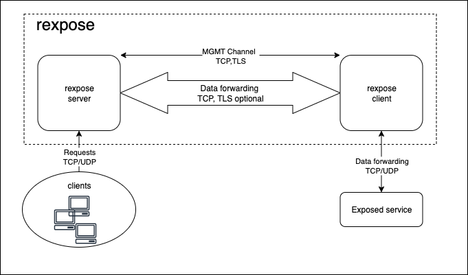

# rexpose

A reverse proxy to expose TCP and UDP services behind any NAT via a public server.

## Install

### From sources

- clone the git repository
- run `cargo install` to install the rexpose binary

## Usage

To start a client exposing a TCP service on port 80 run following command:
`rexpose -P <password> -a <hostname or IP of the server>`

If a self signed certificate is used, the path to the trusted certificate has to be provided: `-c <certificate path>`

To start a server accepting and forwarding TCP connections on port 80 to the client, run following command:
`rexpose -s -P <password>  -c <certificate path> -k <key path>`

The server needs access to a valid certificate and the associated private key to communicate with the client over TLS.
An example for the generation of a self signed certificate for the hostname 'localhost' is provided as following:
`openssl req  -nodes -new -x509 -days 7 -keyout /etc/ssl/private/key.key -out /etc/ssl/certs/cert.cert -addext "subjectAltName = DNS:localhost" -subj "/CN=localhost" -addext "extendedKeyUsage = serverAuth, clientAuth" -addext "keyUsage = digitalSignature,keyAgreement"`

### Argument list

| Argument      | Description                                                       |
| ------------- | ----------------------------------------------------------------- |
| `-s`          | Start in server mode                                              |
| `-a <string>` | Only used in client mode: IP address or hostname of the server    |
| `-m <number>` | Server communication port, default: 8080                          |
| `-p <number>` | Port which should be exposed (client mode) or forwarded to the client (server mode), default: 80|
| `-P <string>` | The password used for authorization between server and client     |
| `-c <string>` | Path to the trusted certificate used for TLS communication between server and client |
| `-k <string>` | Only used in server mode: Path to the private key with which the certificate was created |
| `-u`          | Indicate that the forwarded service is a UDP service              |
| `-e`          | Encrypt all traffic between client and server                     |
| `-v`          | Enable verbose logging                                            |

## Architecture

For the first connection, the client opens a TLS connection to the server and sends the provided password to the server.
If the server accepts the connection, UDP/TCP traffic on the configured port is forwarded to the client via TCP.
With the optional argument `-e`, the forwarded traffic is enrypted using TLS.

